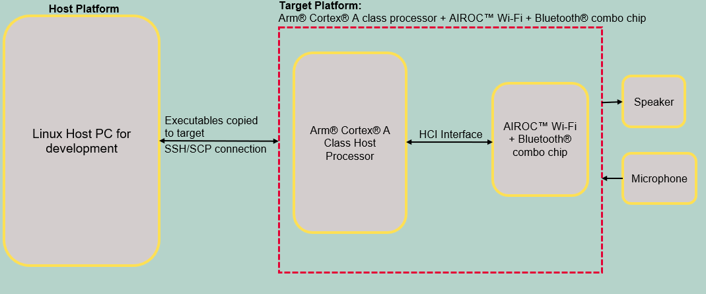
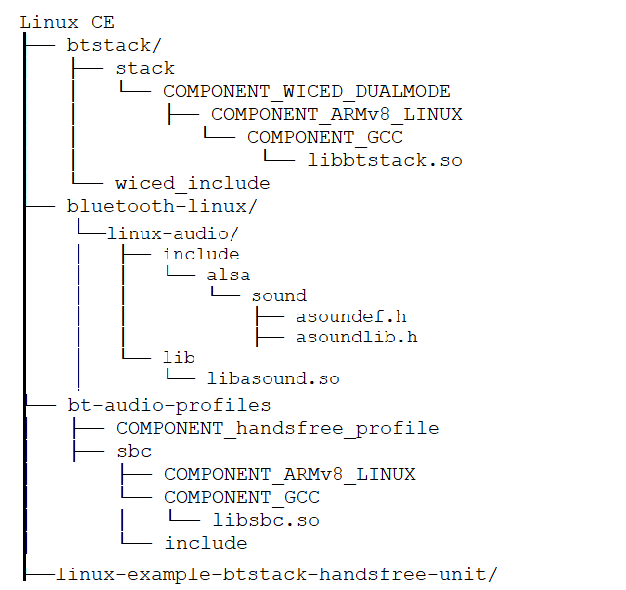
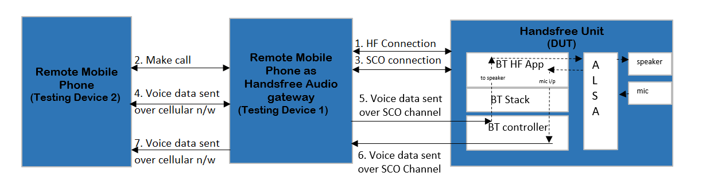

# AIROC™ BTSTACK: Bluetooth® Handsfree Unit for Linux host

The code example demonstrates a Handsfree Unit using AIROC™ Wi-Fi & Bluetooth® Combo Chip on Linux platform.

[View this README on GitHub.](https://github.com/Infineon/linux-example-btstack-handsfree-unit)

[Provide feedback on this code example.](https://cypress.co1.qualtrics.com/jfe/form/SV_1NTns53sK2yiljn?Q_EED=eyJVbmlxdWUgRG9jIElkIjoiQ0UyMzY4OTMiLCJTcGVjIE51bWJlciI6IjAwMi0zNjg5MyIsIkRvYyBUaXRsZSI6IkFJUk9D4oSiIEJUU1RBQ0s6IEJsdWV0b290aMKuIEhhbmRzZnJlZSBVbml0IGZvciBMaW51eCBob3N0IiwicmlkIjoid2FuZyBwaW5nIGNodW4iLCJEb2MgdmVyc2lvbiI6IjEuMC4wIiwiRG9jIExhbmd1YWdlIjoiRW5nbGlzaCIsIkRvYyBEaXZpc2lvbiI6Ik1DRCIsIkRvYyBCVSI6IklDVyIsIkRvYyBGYW1pbHkiOiJBSVJPQyJ9)

## Requirements

- Programming language: C
- Embedded Linux platforms (Arm® Cortex®-A Class processors) for host communications. Supported Embedded Linux host platforms:
   1. RPI CM4-lite IFX custom HW board from Infineon
   2. [IMX8 nano uCOM board](https://www.embeddedartists.com/products/imx8m-nano-developers-kit-v3/) from Embedded Artists
- AIROC™ BTSTACK library and Linux porting layer source code
- AIROC™ Wi-Fi & Bluetooth® Combo Chip Bluetooth® firmware file (*.hcd*).
- Linux Host PC with Ubuntu 20.04


## Supported toolchains (make variable 'TOOLCHAIN')

- GNU Arm® GCC AArch64 v9.3.0 (`GCC_ARM`)

## Supported AIROC™ Wi-Fi & Bluetooth® Combo Chip

- [AIROC™ CYW5557x Wi-Fi & Bluetooth® Combo Chip](https://www.infineon.com/cms/en/product/wireless-connectivity/airoc-wi-fi-plus-bluetooth-combos/wi-fi-6-6e-802.11ax/)

## Hardware setup

Set up the hardware according to the following diagram:

**Figure 1. Block diagram: Hardware setup**



## Software setup

Set up a cross compiler according to the target platform along with CMake on the Linux host PC based on Ubuntu 20.04.

**Note:** These steps are for Arm&reg; 64-based target platform. Review these steps before adding support for any other target.

1. Open a terminal on the Linux host PC.

2. Use the following command to install the cross compiler, build tools, and dependencies:
   ```bash
   sudo apt-get install git cmake gcc-aarch64-linux-gnu build-essential -y
   ```

## Using the code example

Do the following on the Linux host PC to compile the code example:

1. Create a directory under `$HOME` on the host PC and switch to the created directory. Use the following commands:
   ```bash
   mkdir $HOME/Linux_CE
   cd $HOME/Linux_CE
   ```
   **Note:** Replace *Linux_CE* with a directory of your choice.

2. Fetch the code example source code using the following command:
   ```bash
   git clone https://github.com/Infineon/linux-example-btstack-handsfree-unit
   ```

3. Clone or prepare the code example dependencies (BTSTACK library, Linux porting layer, audio profiles source code, and Linux audio library) using the following commands.
   ```bash
   git clone https://github.com/Infineon/btstack --branch release-v3.6.0
   git clone https://github.com/Infineon/bluetooth-linux.git --branch release-v1.0.0
   git clone https://github.com/Infineon/bt-audio-profiles.git --branch release-v1.0.0
   ```

   Creates four different directories after cloning the code example and its dependencies with the directory structure as follows:

   **Figure 2. Code example directory structure**

   

4. Clone the Bluetooth® firmware using following command:
   ```bash
   git clone https://github.com/Infineon/combo-bluetooth-firmware.git
   ```
   The user can choose appropriate Bluetooth® firmware for a particular AIROC™ Wi-Fi & Bluetooth® Combo Chip from the cloned "combo-bluetooth-firmware" directory.

5. Create the build folder under the code example source folder and build the code example using the following commands:
   ```
   cd $HOME/Linux_CE/linux-example-btstack-handsfree-unit
   mkdir build && cd build
   cmake -DCMAKE_C_COMPILER:PATH=<GCC_CROSS_COMPILER> ../ && make
   ```
   Where,
   - `GCC_CROSS_COMPILER` is the target cross compiler for GCC (generally */usr/bin/aarch64-linux-gnu-gcc* for ARM64-based targets)

   The code example executable is generated under the *build* folder with the same name of code example.

   For example, in this project, the "linux-example-btstack-handsfree-unit" executable is generated at */home/$USER/Linux_CE/linux-example-btstack-handsfree-unit/build*.

## Operation

The code example acts as a Handsfree Unit. The remote mobile phone will act as the Handsfree Audio Gateway (HFAG) from where the voice data will be routed to the Handsfree Unit.

### Devices used

- **Device Under Test (DUT):** Embedded Linux host platforms with AIROC™ Wi-Fi & Bluetooth® Combo Chip (target platform) that runs the Handsfree Unit code example.

   Role: "Handsfree Unit" (Unit / HFU)

- **Testing device 1:** Mobile phone

  Role: "Handsfree Audio Gateway" (AG)

- **Testing device 2:** Mobile phone

   Used as: Remote device to make calls with testing device 1

## Operation

1. Copy the code example executable, AIROC™ BTSTACK library, audio profiles source code, Linux audio library, and Bluetooth® firmware file from the Linux host PC to the target platform using [SCP](https://help.ubuntu.com/community/SSH/TransferFiles). For example, use the following commands.
   ```bash
   cd $HOME/Linux_CE/linux-example-btstack-handsfree-unit/build
   scp linux-example-btstack-handsfree-unit <TARGET_USER>@<TARGET_IP>:<TARGET_PATH>/.
   cd $HOME/Linux_CE/btstack/stack/COMPONENT_WICED_DUALMODE/COMPONENT_ARMv8_LINUX/COMPONENT_GCC
   scp libbtstack.so <TARGET_USER>@<TARGET_IP>:<TARGET_PATH>/.
   cd $HOME/Linux_CE/bt-audio-profiles/sbc/COMPONENT_ARMv8_LINUX/COMPONENT_GCC
   scp libsbc.so <TARGET_USER>@<TARGET_IP>:<TARGET_PATH>/.
   scp <FW_FILE.hcd> <TARGET_USER>@<TARGET_IP>:<TARGET_PATH>/.
   ```
   Where,
   - `TARGET_USER` is the user name of the target platform.
   - `TARGET_IP` is an IP address of the target platform.
   - `TARGET_PATH` is the path of target platform.
   - *`FW_FILE.hcd`* file is Bluetooth® firmware file cloned in step-4 of [Using the code example section](#using-the-code-example).

2. Take SSH console of target platform.
   ```bash
   ssh <TARGET_DEVICE_USER_NAME>@<TARGET_DEVICE_IP_ADDRESS>
   ```

3. Add the udev rule in the target board for HCI UART and GPIO to bypass root access. Use the following steps to create and set up a udev rule.

   **Note:** If you have root access, the following udev rules are not required; you can execute the code example with `sudo` permissions or by switching to the root user.

   1. Create a new *.rules* (for example, *combo-chip-uart-port.rules*) file under */etc/udev/rules.d/* directory for HCI UART. Use the following commands:

      **IMX8Nano:**

      ```bash
      echo "KERNEL==\"ttymxc0\"d,SYMLINK+=\"combo_chip_uart\",MODE=\"0666\"" | sudo tee /etc/udev/rules.d/combo-chip-uart-port.rules
      ```

      **RPICM4:**

      ```bash
      echo "KERNEL==\"ttyAMA0\",SYMLINK+=\"combo_chip_uart\",MODE=\"0666\"" | sudo tee /etc/udev/rules.d/combo-chip-uart-port.rules
      ```

   2. Create new *.rules* (for example, *combo-chip-gpio-port.rules*) for BT_REG_ON GPIO under */etc/udev/rules.d/*. Use the following commands:

      **IMX8Nano and RPICM4:**

      1. Create a rule file using the following command.

         ```bash
         sudo vim /etc/udev/rules.d/combo-chip-gpio-port.rules.rules
         ```

      2. Add the following rules in created files:

         ```bash
         SUBSYSTEM=="gpio*", PROGRAM="/bin/sh -c 'chown -R $user:$group /sys/class/gpio/export /sys/class/gpio/unexport;'"
         SUBSYSTEM=="gpio*", PROGRAM="/bin/sh -c 'chown -R $user:$group /sys%p/direction /sys%p/value; chmod 660 /sys%p/direction /sys%p/value;'"
         ```

   3. Reboot the target device:

      ```bash
      sudo reboot
      ```

       Where,

      - `ttymxc0` and `ttyAMA0` are HCI UART ports for IMX8Nano and RPICM4 respectively.
      - `combo_chip_uart` is a friendly name for the HCI UART port.
      - `0666` is the permission mask to bypass the root access for HCI UART.

4. Set the default audio sink and source (USB speaker and MIC connected to target board) to the selected audio rendering and capturing device.
   ```bash
   pacmd set-default-sink <SINK_INDEX>
   pacmd set-default-source <SOURCE_INDEX>
   ```
   Where,
   - `SINK_INDEX` is the index of connected audio sink device.
   - `SOURCE_INDEX` is the index of connected audio source device.  
   The user can refer [these steps to learn how to identify and set default source and sink device using pulseaudio](https://wiki.archlinux.org/title/PulseAudio/Examples#Set_default_input_source)

5. Execute the application with setting the paths of the AIROC™ BTSTACK library using the following command on the target platform:

   ```bash
   cd <TARGET_PATH>
   chmod +x <APP_NAME>
   LD_LIBRARY_PATH=$LD_LIBRARY_PATH:<BTSTACK_LIB_PATH>
   ./<APP_NAME> -c <COM_PORT> -b 3000000 -f 921600 -r <GPIOCHIPx> <REGONPIN> -n -p <FW_FILE_NAME>.hcd -d 112233221137
   ```
   Where,
   - `APP_NAME` is the code example application executable.
   - `TARGET_PATH` is the path of the target platform where the code example application copied to.
   - `BTSTACK_LIB_PATH` is the path of the AIROC™ BTSTACK library. Skip this if the AIROC™ BTSTACK library and code example application executable are in the same folder.
   - `/dev/ttymxc0` is the COM_PORT for IMX8Nano.
   - `/dev/ttyAMA0` is the COM_PORT for RPICM4.
   - `3000000` is the HCI baud rate.
   - `112233221137` is a device BD address.
   - `-r <GPIOCHIPx> <REGONPIN> -n`  is setting the GPIO control to enable autobaud for AIROC™ Wi-Fi & Bluetooth® Combo Chip.
      - `-r gpiochip5 0 -n`  For IMX8Nano
      - `-r gpiochip0 3 -n`  For RPICM4
   - `921600` is the firmware download baud rate.
   - *`.hcd`* is the firmware file to download (make sure to validate this firmware file file path).

      **Note:** Currently, random BD addresses are used for testing.

6. On the Handsfree Unit side, do the following to set up an audio call using the Handsfree code example:

   1. Note that the following HF Unit menu options are displayed on executing the terminal:

      ```bash
         ---------------------HFU MENU-----------------------
      0.  Exit
      1.  Print Menu
      2.  Set Visibility
      3.  Set Pairing Mode
      4.  Set Inquiry
      5.  HF Connect
      6.  HF Disconnect
      7.  Update Available Codec
      8.  Print HF Connection Details
      9.  Answer Call
      10. Hangup Call
      11. Dial Number
      12. Redial
      13. Query Current Calls
      14. Set Speaker Volume
      15. Set Microphone Volume
      16. Get Subscriber Info
      ```

    2. Set the DUT to *Discoverable* and *Connectable*:

       1. Choose **Option 2** (Set Visibility)

       2. Enter discoverability:

          0: Non Discoverable, 1: Discoverable

       3. Enter "1" to make it discoverable.

       4. Enter connectability:

          0: Non Connectable, 1: Connectable

       5. Enter "1" to make it connectable.

    3. Set the DUT to *Pairable*:

       1. Choose **Option 3** (Set Pairing Mode).

       2. Enter whether pairing is allowed:

          0: Not allowed, 1: Allowed

       3. Enter "1" to make it pairable.

    4. Discover and connect the Handsfree Unit (DUT) from the remote mobile phone (Testing Device 1) acting as the Audio Gateway. Alternatively, use this option to connect from Handsfree Unit to an already paired device:

       1. Choose **Option 4** (Set Inquiry).

       2. Enter whether inquiry must be enabled or disabled:

          0: Disabled, 1: Enabled

       3. Enter "1".

          ```bash
          --------------------------------------------
          10:33:10.671   Inquiry Result: B2 56 E3 03 70 D2
          10:33:10.671   Clock Offset = 0xc06a
          10:33:10.671   RSSI = -94
          --------------------------------------------
          Inquiry Complete
          ```

       4. Choose **Option 5** (HF Connect).

       5. Enter Peer BD Address:
          ```bash
          B2 56 E3 03 70 D2
          ```

    5. Place a call from the Handsfree Unit (DUT) as follows:

       1. Choose **Option 11** (Dial Number).

          ```bash
          ----------------HF CONNECTION DETAILS----------------------------
          BD ADDRESS               CONNECTION HANDLE       SCO INDEX
          B2 56 E3 03 70 D2        2                       0
          -----------------------------------------------------------------
          Enter the Connection Handle: 2
          Enter the Number to be Dialed: <enter number to be dialled>
          ```

       Alternatively, the call can be placed from the remote AG (Testing Device 1) or remote mobile phone (Testing Device 2).

    6. Pick the call at the remote mobile phone (Testing Device 2). The Synchronous Connection Oriented (SCO) channel will be created and the voice from the remote mobile phone (Testing Device 2) should be heard over the Handsfree Unit and the voice from the handsfree Unit should be heard over the remote mobile phone (Testing Device 2).

       If the call was placed from the remote mobile phone (Testing Device 2), answer the call either from the remote AG (Testing Device 1) or from the Handsfree Unit (DUT) using **Option 9** (Answer Call).

    7. Hang up the phone call as follows:

       1. Choose **Option 10**.

          ```bash
          ----------------HF CONNECTION DETAILS----------------------------
          BD ADDRESS               CONNECTION HANDLE       SCO INDEX
          B2 56 E3 03 70 D2        2                       0
            -----------------------------------------------------------------
          Enter the Connection Handle: 2
          ```

    8. Disconnect the HF as follows:

       1. Choose **Option 6**.

          ```bash
          ----------------HF CONNECTION DETAILS----------------------------
          BD ADDRESS               CONNECTION HANDLE       SCO INDEX
          B4 56 E3 03 70 D1        2                       0
          -----------------------------------------------------------------
          Enter the Connection Handle to disconnect: 2
          ```

    9. Exit the application as follows:

       1. Choose **Option 0**.


**Note:** Run the application without any arguments to get details of command-line arguments. At any instance, choose **Option 1** to print the menu options. Choose **Option 8** to print the connection details at any instance.

**Note:** Bonded device list size is 1; therefore, only one device's pairing information can be stored at a time.

## Debugging

You can debug the example using a generic Linux debugging mechanism such as the following:

- **Debugging by logging:** Add prints in the application and check them during execution.

- **Debugging using GDB:** See [GDB man page](https://linux.die.net/man/1/gdb) for more details.


## Design and implementation

**Figure 3. Code example design**

   

1. The handsfree connection is created between the Handsfree Audio Gateway and the Handsfree Unit either by initiating from the AG or from the Handsfree Unit.

2. A phone call can be placed between the remote mobile phone (Testing Device 2) and the remote AG (Testing Device 1) in any of the following ways:

   - Make a call from the remote mobile phone (Testing Device 2) to the Remote AG (Testing Device 1)

   - Make a call from the remote AG (Testing Device 1) to the remote mobile phone (Testing Device 2)

   - Send a command from the Handsfree Unit (DUT) to the remote AG (Testing Device 1) to place a call to the remote mobile phone (Testing Device 2)

3. A SCO audio channel is created between the remote AG (Testing Device 1) and the Handsfree Unit (DUT) when a call is made.

4. The voice data captured on the remote mobile phone (Testing Device 2) is sent over the cellular network to the remote AG (Testing Device 1).

5. The voice data from the remote AG (Testing Device 1) is forwarded to the Handsfree Unit (DUT) over the SCO channel.

6. The Bluetooth&reg; controller decodes the data and sends the pulse-code modulation (PCM) samples to the application. The application sends the PCM SCO data to the ALSA for playback. The application captures the microphone (mic) input and sends it to the Bluetooth&reg; controller. The Bluetooth&reg; controller encodes the data and sends it to the remote AG (Testing Device 1) over SCO channel.

7. The remote AG (Testing Device 1) sends the voice data over a cellular network to the remote mobile phone (Testing Device 2).

## Source files

 File   | Description
 ------- | ---------------------
*app/handsfree_unit_main.c*  | Implements the main function which takes the user command-line inputs. Implements a CLI to take user inputs and acts accordingly. Calls the *handsfree_unit_api.c* functions for all the Handsfree Unit profile functionalities.
*app/handsfree_unit_api.c*  | Provides API functions to call for GAP and Handsfree Unit functionality
*app/handsfree_unit_evt_handler.c*  | Implements handlers for events such as Bluetooth&reg; stack events, inquiry results, HF events, and SCO events
*app/audio_platform_common.c* | Interface file for taking input and providing output to the ALSA driver
*app_bt_utils/app_bt_utils.c*  | Contains utility functions. For example, it contains functions to print error codes, status, etc. in user-understandable format.
*app_bt_utils/app_bt_utils.h*  | Header file corresponding to *app_bt_utils.c*
*app_bt_config/handsfree_unit_bt_cfg.c*  | Pre-generated using the Bluetooth&reg; Configurator on Windows. Contains configurations related to Bluetooth&reg; settings, GAP, and HF.
*include/handsfree_unit.h*  | Header file for the Handsfree unit code
*include/audio_platform_common.h* | Header file for *audio_platform_common.h*

### Resources and settings

**Table 1. Application resources**

 Resource  |  Alias/object     |    Purpose
 :-------- | :-------------    | :------------
 UART |HCI| UART is used for HCI communication with host system

<br>

## Related resources

Resources  | Links
-----------|----------------------------------
Device documentation | [CYW5557x](https://www.infineon.com/cms/en/product/wireless-connectivity/airoc-wi-fi-plus-bluetooth-combos/cyw5557x/)
AIROC™ BTSTACK library | [AIROC™ BTSTACK library](https://github.com/Infineon/btstack/tree/release-v3.6.0)
Linux porting layer source code | [Linux porting layer source code](https://github.com/Infineon/bluetooth-linux/tree/release-v1.0.0)

## Other resources

Infineon provides a wealth of data at [www.infineon.com](https://www.infineon.com/) to help you select the right device, and quickly and effectively integrate it into your design.

## Document history

Document title: *CE236893* – *AIROC™ BTSTACK: Bluetooth® Handsfree Unit for Linux host*

 Version | Description of change
 ------- | ---------------------
 1.0.0   | New code example

<br>

--------
© Cypress Semiconductor Corporation, 2023. This document is the property of Cypress Semiconductor Corporation, an Infineon Technologies company, and its affiliates ("Cypress").  This document, including any software or firmware included or referenced in this document ("Software"), is owned by Cypress under the intellectual property laws and treaties of the United States and other countries worldwide.  Cypress reserves all rights under such laws and treaties and does not, except as specifically stated in this paragraph, grant any license under its patents, copyrights, trademarks, or other intellectual property rights.  If the Software is not accompanied by a license agreement and you do not otherwise have a written agreement with Cypress governing the use of the Software, then Cypress hereby grants you a personal, non-exclusive, nontransferable license (without the right to sublicense) (1) under its copyright rights in the Software (a) for Software provided in source code form, to modify and reproduce the Software solely for use with Cypress hardware products, only internally within your organization, and (b) to distribute the Software in binary code form externally to end users (either directly or indirectly through resellers and distributors), solely for use on Cypress hardware product units, and (2) under those claims of Cypress’s patents that are infringed by the Software (as provided by Cypress, unmodified) to make, use, distribute, and import the Software solely for use with Cypress hardware products.  Any other use, reproduction, modification, translation, or compilation of the Software is prohibited.
<br>
TO THE EXTENT PERMITTED BY APPLICABLE LAW, CYPRESS MAKES NO WARRANTY OF ANY KIND, EXPRESS OR IMPLIED, WITH REGARD TO THIS DOCUMENT OR ANY SOFTWARE OR ACCOMPANYING HARDWARE, INCLUDING, BUT NOT LIMITED TO, THE IMPLIED WARRANTIES OF MERCHANTABILITY AND FITNESS FOR A PARTICULAR PURPOSE.  No computing device can be absolutely secure.  Therefore, despite security measures implemented in Cypress hardware or software products, Cypress shall have no liability arising out of any security breach, such as unauthorized access to or use of a Cypress product. CYPRESS DOES NOT REPRESENT, WARRANT, OR GUARANTEE THAT CYPRESS PRODUCTS, OR SYSTEMS CREATED USING CYPRESS PRODUCTS, WILL BE FREE FROM CORRUPTION, ATTACK, VIRUSES, INTERFERENCE, HACKING, DATA LOSS OR THEFT, OR OTHER SECURITY INTRUSION (collectively, "Security Breach").  Cypress disclaims any liability relating to any Security Breach, and you shall and hereby do release Cypress from any claim, damage, or other liability arising from any Security Breach.  In addition, the products described in these materials may contain design defects or errors known as errata which may cause the product to deviate from published specifications. To the extent permitted by applicable law, Cypress reserves the right to make changes to this document without further notice. Cypress does not assume any liability arising out of the application or use of any product or circuit described in this document. Any information provided in this document, including any sample design information or programming code, is provided only for reference purposes.  It is the responsibility of the user of this document to properly design, program, and test the functionality and safety of any application made of this information and any resulting product.  "High-Risk Device" means any device or system whose failure could cause personal injury, death, or property damage.  Examples of High-Risk Devices are weapons, nuclear installations, surgical implants, and other medical devices.  "Critical Component" means any component of a High-Risk Device whose failure to perform can be reasonably expected to cause, directly or indirectly, the failure of the High-Risk Device, or to affect its safety or effectiveness.  Cypress is not liable, in whole or in part, and you shall and hereby do release Cypress from any claim, damage, or other liability arising from any use of a Cypress product as a Critical Component in a High-Risk Device. You shall indemnify and hold Cypress, including its affiliates, and its directors, officers, employees, agents, distributors, and assigns harmless from and against all claims, costs, damages, and expenses, arising out of any claim, including claims for product liability, personal injury or death, or property damage arising from any use of a Cypress product as a Critical Component in a High-Risk Device. Cypress products are not intended or authorized for use as a Critical Component in any High-Risk Device except to the limited extent that (i) Cypress’s published data sheet for the product explicitly states Cypress has qualified the product for use in a specific High-Risk Device, or (ii) Cypress has given you advance written authorization to use the product as a Critical Component in the specific High-Risk Device and you have signed a separate indemnification agreement.
<br>
Cypress, the Cypress logo, and combinations thereof, WICED, ModusToolbox, PSoC, CapSense, EZ-USB, F-RAM, and Traveo are trademarks or registered trademarks of Cypress or a subsidiary of Cypress in the United States or in other countries. For a more complete list of Cypress trademarks, visit www.infineon.com. Other names and brands may be claimed as property of their respective owners.
